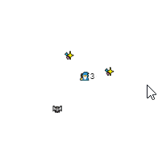

# Wizard Survivors

<div align="center" style="margin:60px 0">
    <p></p>
</div>

---

<div align="center">
    <a href="https://www.kesiev.com/wizardsurvivors/">Play!</a><br>
</div>

---

## Story

**Wizard Zurlee** has been trapped by a horde of _deadly vampire bats_! Use WASD to escape, hit enemies with your magical spinning bolts, and grow your power until you _become the bullet hell_!

<div align="center" style="margin:60px 0">
    <p></p>
</div>

## The game

**Wizard Survivors** is inspired by the infectious [Vampire Survivors](https://store.steampowered.com/app/1794680/Vampire_Survivors/). The game source is 500 characters long, so it can be posted on a single post Toot on [Mastodon](https://en.wikipedia.org/wiki/Mastodon_(social_network)). To play the game just create an empty `.html` on your computer, paste this code, and open it up with a web browser.

```
<canvas id=C><svg onload="X=C.getContext`2d`,E=Array(D=99).fill(0),S=Math.sin,L=[3,setInterval('L[1]+=I=.05,C.width=C.height=D*2,L[0]>1&&E.map((i,w)=>{with(i)e=w%2,i&&(e?A(x)&A(y)?!L[0]--:onkeyup=onkeydown=x=>L[x.key]=x.type[5]&&2:E.map((n,z)=>z%2&A(n.x-x)&A(n.y-y)?L[E[z]=r=0]+=I:V=c=>e*c+1-(c>0)*2)&&x<D)?x=V(x,y=V(y)+S(1.5-s)*r-~L.w+~L.s,r=!e*r+1,X[F](e?`🦇`:`✨`,D+x,D+y))+S(s+=I)*r-~L.a+~L.d:w<L[e]?E[w]={x:S(o=new Date)*D,y:S(1.5-o)*D,r:0,s:w}:A=c=>c*c<D}),X[F=`fillText`](`🧙`+~~L[0],D,D)',40)]">
```

I've used no packer, so the characters are all printable. You can print it on your T-Shirt and use it as an _emergency game_ if you feel the urge of slaying bats, level up, and become an unstoppable killing machine for a minute.

## Why?

At the very beginning of [The Game Awards 2022](https://youtu.be/vl9yakt_5tc?t=307) they announced a [free mobile version](https://play.google.com/store/apps/details?id=com.poncle.vampiresurvivors&hl=en&gl=US) of **Vampire Survivors**. I didn't know the game so I downloaded it to my phone and gave it a quick try. Then I missed the rest of the event.

_Pro-tip: never give free carefully crafted distractions at the start of a conference! ;)_

### Technical notes

The game should work without problems if run from a local file. You may need the `.htaccess` file if you want to host it on the web.

## Tech notes

The game should run OK if you load `.html`

## Credits

### Thanks

  - [Bianca Brenna](http://www.linearkey.net/)
